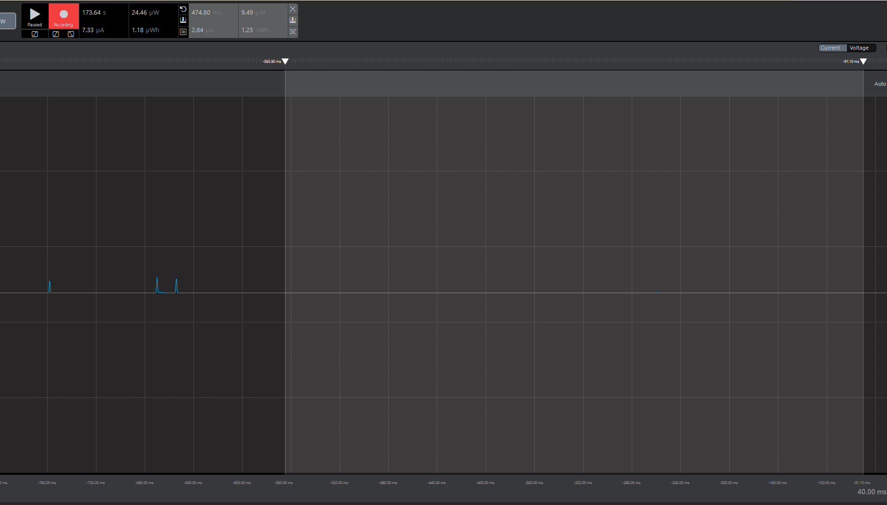

Please include your answers to the questions below with your submission, entering into the space below each question
See [Mastering Markdown](https://guides.github.com/features/mastering-markdown/) for github markdown formatting if desired.

*Be sure to take measurements in the "Default" configuration of the profiler to ensure your logging logic is not impacting current/time measurements.*

*Please include screenshots of the profiler window detailing each current measurement captured.  See [Shared document](https://docs.google.com/document/d/1Ro9G2Nsr_ZXDhBYJ6YyF9CPivb--6UjhHRmVhDGySag/edit?usp=sharing) for instructions.* 

1. What is the average current per period?
   Answer:
   7.02uA

    Screenshot:  
     

2. What is the average current when the Si7021 is Load Power Management OFF?
   Answer:
   2.84uA

    Screenshot:  
   

3. What is the average current when the Si7021 is Load Power Management ON?
   Answer:
   120.39uA

    Screenshot:  
   

4. How long is the Si7021 Load Power Management ON for 1 temperature reading?
   Answer:
   106.80msec

    Screenshot:  
   See image above for Question 3.

5. What is the total operating time of your design for assignment 4 in hours assuming a 1000mAh supply?
   Answer:
   Since 1 period of 3 seconds equals 7.02uA of average current, multiplying this value by 1200 (total number of 3-second periods within 1 hour) gives us 8472uAh (or 8.472mAh).

6. How has the power consumption performance of your design changed since the previous assignment?
   Answer:
   Polling is no longer being used, allowing us to enter sleep and deep sleep modes more often as the system can wait for interrupt events to occur. This particularly impacts the Power Management ON period, which is now able to enter sleep modes while waiting for I2C responses from the SI7021 device.

7. Describe how you have tested your code to ensure you are sleeping in EM1 mode during I2C transfers.
   Answer:
   Added breakpoints to I2C entry and exit points and within i2c0EM1BlockStart() and i2c0EM1BlockEnd() methods to ensure EM1 sleep mode was entered and exited as expected.
