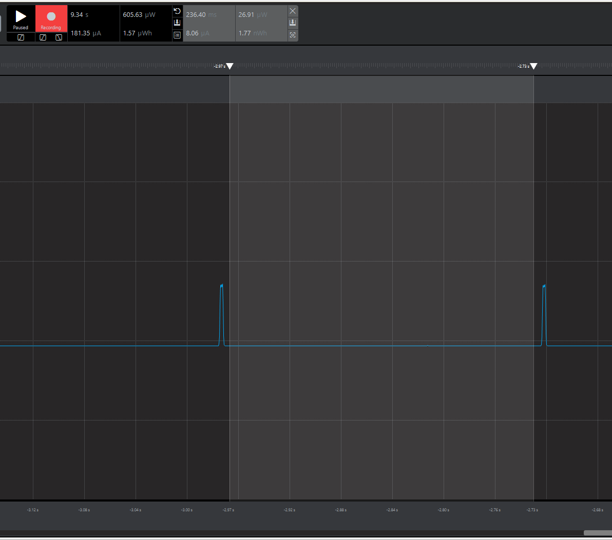
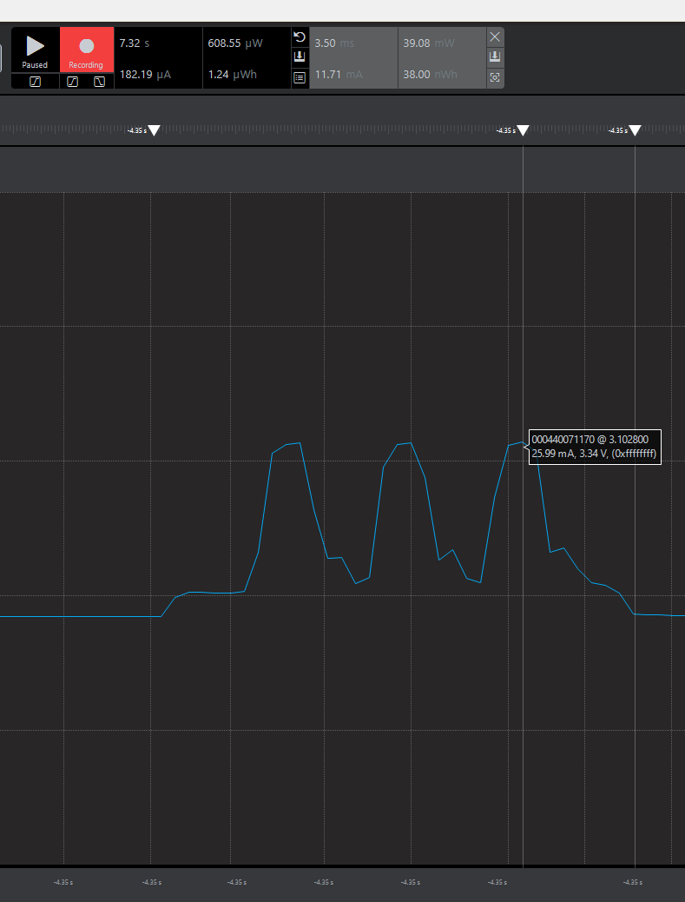
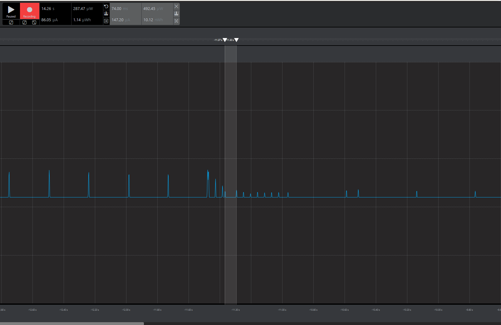
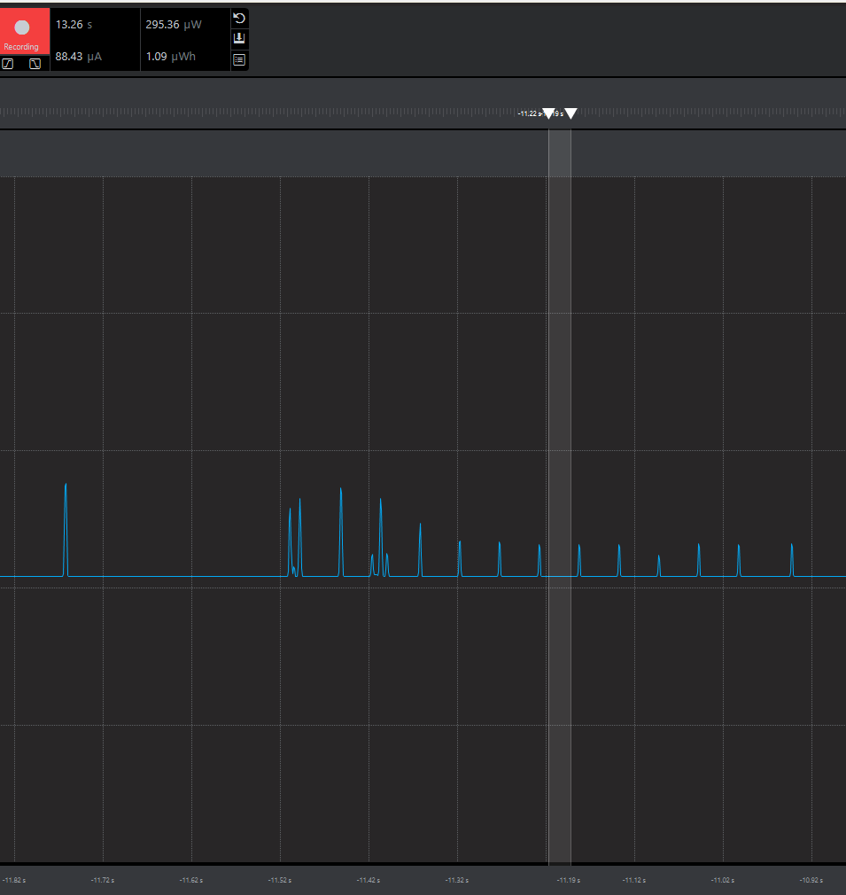
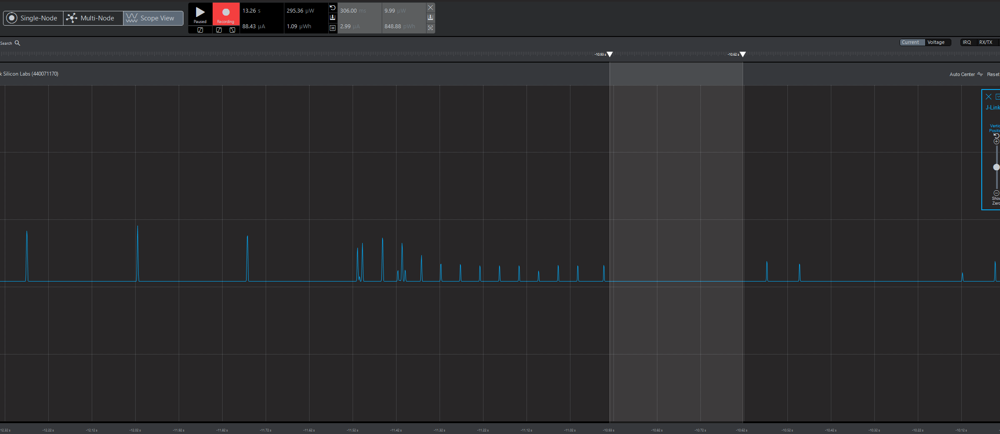
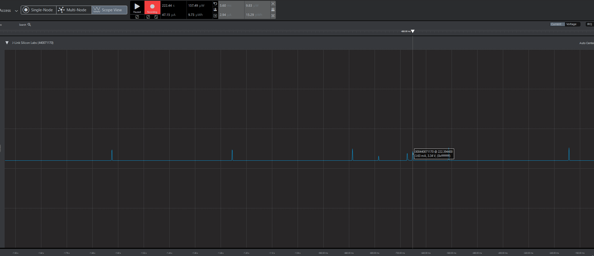
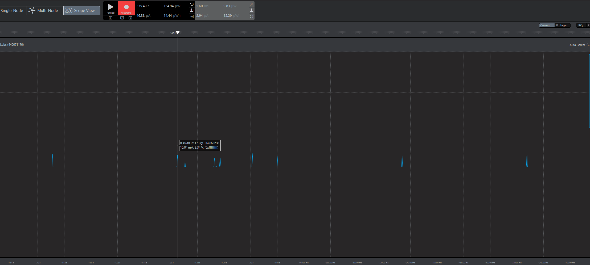

Please include your answers to the questions below with your submission, entering into the space below each question
See [Mastering Markdown](https://guides.github.com/features/mastering-markdown/) for github markdown formatting if desired.

*Be sure to take measurements in the "Default" configuration of the profiler to ensure your logging logic is not impacting current/time measurements.*

*Please include screenshots of the profiler window detailing each current measurement captured.  See [Shared document](https://docs.google.com/document/d/1Ro9G2Nsr_ZXDhBYJ6YyF9CPivb--6UjhHRmVhDGySag/edit?usp=sharing) for instructions.* 

1. Provide screen shot verifying the Advertising period matches the values required for the assignment.
    Screenshot:  
   

2. What is the average current between advertisements?
   Answer: ~8 uA
    Screenshot:  
     

3. What is the peak current of an advertisement? 
   Answer: 25.99 mA
    Screenshot:  
     

4. Provide screen shot verifying the connection interval setting matches the value required for the assignment.
    Screenshot: 
     

5. What is the average current between connection intervals?
   Answer: 147.82 uA
    Screenshot:  
     

6. Provide screen shot verifying the slave latency matches the value required for the assignment. 
    Screenshot:  
   

7. What is the peak current of a data transmission when the phone is connected and placed next to the Blue Gecko? 
   Answer: 3.63 mA
    Screenshot:  
   
   
8. What is the peak current of a data transmission when the phone is connected and placed 20 feet away from the Blue Gecko? 
   Answer: 10 mA
    Screenshot:  
    
   
